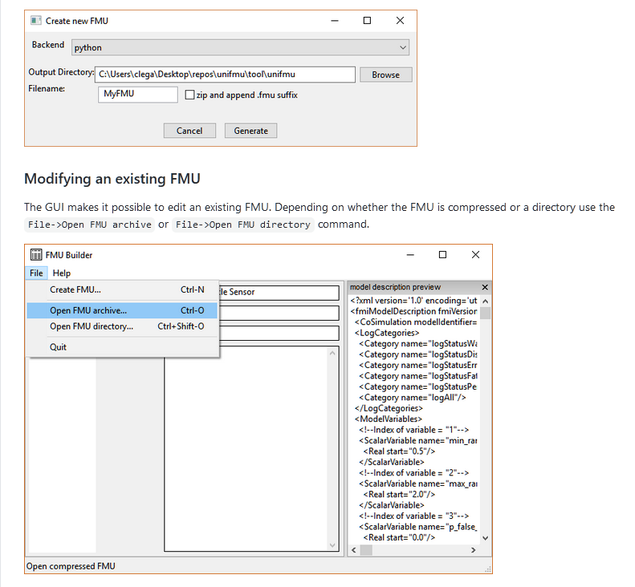
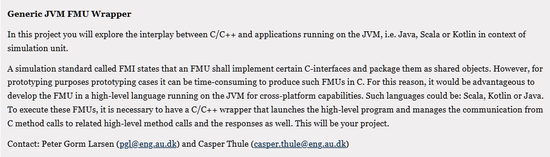

<script src="https://code.jquery.com/jquery-1.11.1.min.js">
</script>
<script src="/javascripts/edit.js"></script>
<script>setEditButonNm();</script>

# {{ page.title }}

|      |                              |
| ---- | ---------------------------- |
| Date | 24 November 2020, 14:00 CEST |

## Pre-meeting stakeholders' reports

<!-- Please keep in mind that the minutes are publicly available.-->

#### Peter Gorm Larsen

- Made opening presentation for the webinar on the 25th of November
- Polished a bit on various Overture papers
- Met with Technicon regarding their MADE FAST part project with Daniella
- Met with Novo regarding their MADE FAST project with Fatemeh
- Discussed equipment for Ringkjøbing-Skjern with Emil
- Working on presentations for kick-off meeting with Ringkjøbing Skjern
- Preparing digital twin presentation for MADE innovation event

#### Claudio Gomes

- Met with Novo and Technicon (with Peter, Fateme, and Daniella)
- Advances on the background section on M&S for ML Survey (with Christian)
- Planned roadmap for digital twinning of incubator case study (with Hao, Till, Casper)
- Draft of scenario verification tool (with Simon, Maurizio, Casper)
- Met with digit brain stakeholders to discuss basics of FMI (with Prasad)

#### Nick Battle

- Continue LSP Combinatorial Testing implementation with Jonas and Frederik
- Add error numbers to VDMCheck static semantic model for Maestro integration
- Fix some VDMJ/Overture problems (via Leo)
- Look at CT examples for PGL - Luhn model proposed and working on Basket Service model
- Fixed a memory leak in VDMJ for CT
- Made 4.4.0 release of VDMJ for Maestro, bumping to 4.4.1-SNAPSHOT

#### CAsper Thule

- Typechecker for Maestro2
- Multi-dimensional arrays for Maestro2
- Maestro2 presentation
- Working with Claudio, Simon, Maurizio on UPPAAL model
- Interested in verifying MaBL scenario and FMU employment via UPPAAL model - how do we verify all traces of a MaBL program? Control flow graph?
- Supporting Gita with fault-injection.

#### Christian Møldrup Legaard

- won't be at meeting today
- Implemented a generic solution for implementing FMUs in **ANY** language.
- Based on the lessons learned from PyFMU.
- Advantages:
  - Language agnostic
  - Remote deployment possible (just ssh into remote and launch)
  - Standalone, easy to bundle runtime in FMU
  - Precompiled binaries. No need to install compiler toolchain, cross-platform support out of box

```toml
[command]
windows = [ "python", "launch.py" ]
linux = [ "python3", "launch.py" ]
macos = ["python3","launch.py"]
```

- GUI + CLI for creating and modifying FMUs



- [UniFMU repostiory](https://github.com/INTO-CPS-Association/unifmu)

- Intrested in:

  - "Java and friends" backend
    

- Working on DL+M&S survey (with Claudio)

#### Hugo Daniel Macedo
- Released Overture 3.0.2
- Prepared a release candidate for 4.0.1 for the INTO-CPS Application. Testing the new changes and starting to test the MaestroV2. 
- Met with WATEC and starting to developing ideas on Digital Twins for Water comsumption
- Provided input for the Digitalization track of a White Book Strategy document for the new Tech faculty at AU

#### Maurizio Palmieri
- Working with Claudio, Simon, Casper on UPPAAL model
- Introduced a collegue from University of Milan to FMI and INTO-CPS (thanks to PyFMU)
	- they have a python network simulator that we want to couple with Simulink model of cars.
- Perfomed a preliminary analysis on a new case study that will be used in the EPI european project (it also involves INTO-CPS and DSE)
- Starting the process of collecting the project assigned to students about data alteration attacks on the LFR.

#### Emil Madsen
- AU-DTL Skjern project:
  - Responsible for acquiring production equipment and 
  - The company Technicon is currently working out an offer
  - Festo Didactic CP Factory equipment was considered but it is too expensive
- UR robot modeling and calibration:
  - equations formulated linearly in the dynamic parameters
  - allows for very fast least squares calibration using Moore-Penrose generalized/pseudo inverse (5 seconds vs 8 hours for nonlinear optimization)

#### Mirgita Frasheri
- Discussed with Casper and Kenneth the best way to implement inputs in rabbitMQ. Based on their input, switched from the solution with flags, 
to sending on change. Close to the next rabbitMQ release.
- Talked with Hugo about the DSE and building scenarios for simulation, including fault injection. Also discussing the latter with Casper and Kenneth, and whether it is something we want for maestro.
- Working also on the autonomy paper.

#### Daniella Tola
- Met with Technicon
- Working on a more elaborate project description.
- Still looking at different DSLs, and methods to describe manufacturing robots, e.g. which attributes are important for a robotic arm, or for a tool etc.
- Will visit SDU robotlab 8/12 and Aalborg robotlab 14/12

#### Hao Feng
- The technical report is closed to be finished. 
- Meet with Claudio about the road for publications.
- Wrote the controller codes for the incubator and co-somulation. 
-Investigated a platoon control with time delay. 

## Sub-projects status

#### Sub-project X

#### Sub-project Y

#### Sub-project Z

## Any Other Business

## Next Meeting

08 December 2020, 14:00 CEST

<div id="edit_page_div"></div>
